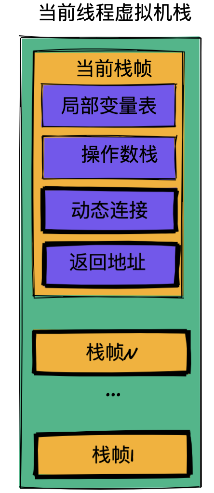

## 【B】Java -- JVM原理


### 输出倒逼输入

- Java程序启动过程（5个过程）；
- Java内存回收机制（包括回收算法）；
- jvm线程私有的有哪些

- **java类加载过程，ClassLoader 的双亲委派机制**
- 内存中堆与栈的区别，什么时候在栈中什么时候在堆中
- java gc是如何回收对象的，可以作为gc根节点的对象有哪些？
-  jvm的内存模型是什么样的？如何理解java的虚函数表？
- **引用，（强、弱、软、虚，以及之间的异同）**


### JVM 运行时数据区

Java虚拟机在指定Java程序的过程中会把它所管理的内存划分为若干个不同的数据区域。其中线程共享的**方法区（运行时常量区）、堆** ；线程私有的**虚拟机栈、本地方法栈、程序计数器**。 


#### 程序计数器

当前线程正在执行Java方法的时候，计数器值为正在执行的字节码指令的地址。如果正在执行的是native方法，那这个计数器值为空。


> why 程序计数器?

 1）时间片轮转，当线程被挂起，需要程序计数器保存程序执行现场；

 2）条件、循环、异常处理，也需要借助程序计数器实现


程序计数器很小，它是JVM内存区域中唯一不会OOM的区域。


#### 虚拟机栈

虚拟机栈也是线程私有的，与线程生命周期同步。

线程中的方法调用所需的数据，指令、返回地址。通过封装成栈帧结构，入栈和出栈，类比手枪的一个弹夹。


Java虚拟机规范对这个区域规定了两种异常状况：

1. StackOverFlowError：当线程请求栈深度超过虚拟机栈所允许的深度时抛出
2. OutOfMemorryError：当Java虚拟机动态扩展到无法申请足够内存时抛出。


##### 栈帧

每个方法生成一个栈帧。压入当前线程自己的虚拟机栈。

栈帧就类比弹夹里的一个个子弹。




- **局部变量表**

  方法传参

  局部变量 -- 8大基础数据类型、引用（真正的对象放在堆里）。

  

- **操作数栈**

  我们常说的JVM是基于栈，Android 里的虚拟机DVM和ART是基于寄存器的。这里指的就是操作数栈

  存放方法的执行和操作.

  > JVM字节码指令集 助记符

  https://cloud.tencent.com/developer/article/1333540

  操作数栈可以存放任意Java数据类型包括long和double。
  
  


- **动态连接**

  多态处理：静态分派、动态分派

  在Class文件中，一个方法要调用其他方法，需要将这些方法的符号引用转化为其所在内存地址中的直接引用，而符号引用存在于方法区中。虚拟机栈中，每个栈帧都包含一个指向运行时常量池中该栈帧所属方法的符号引用，持有这个引用的目的就是为了支持方法调用过程中的动态连接。

  

- **完成出口（返回地址）**

  正常返回 -- 调用者的程序计数器数值，作为返回地址

  异常返回 -- 异常处理器表

  


iconst和bipush 指令：都是将常量压入操作数栈顶，当int取值 -1～5 采用iconst取值-128～127采用bipush

istore：将操作数栈顶元素放入局部变量表的某索引位置

iload：将局部变量表中某下标上的值加载到操作数栈顶。

iadd指令：将操作数栈中栈顶，两个元素弹出，执行加法运算并将结果重新压回操作数栈。


#### 本地方法栈

保存native方法的信息。当一个JVM创建的线程调用native方法后，JVM不再为其在虚拟机栈中创建栈帧，JVM只是简单地动态链接并直接调用native方法。


#### 方法区

JVM在执行某个类的时候必须先经历加载类（加载、验证、准备、解析、初始化），方法区存储了JVM所加载的类：

- 类的描述信息（版本，字段，方法，接口等描述信息）
- 常量
- 静态变量
- 即时编译器编译后的代码和数据


​    class文件中除了类描述信息外，还有一项常量池（Constant Pool），用于存放编译期间生成的各种字面量和符号引用。字面量包括字符串、基本类型的常量（final修饰），符号引用则包括类和方法的全限定名（例如String这个类的全限定名Java/lang/String）。类加载到内存后，JVM会将class文件常量池中的内容放到运行时常量池中，并在解析阶段把符号引用替换为直接引用（对象的索引值）。

​	方法区与堆空间类似，也是一个共享内存区，所以方法区是线程共享的。假如两个线程都试图访问方法区中的同一个类信息，而这个类还没有装入 JVM，那么此时就只允许一个线程去加载它，另一个线程必须等待。


方法区只是JVM规范中提出的一种要求规范，规定这一区域要存放哪些数据，并不是实际虚拟机中的实现。

关于方法区在HotSpot虚拟机中的实现：

JDK 1.7 时代，使用永久代来实现方法区（但静态变量和运行时常量池转移到了堆中）

> 堆内存大小设置参数：

```
-Xmx 堆区内存可被分配的最大上限
-Xms 堆区内存初始内存分配大小
```


JDK 1.8 之后，使用元空间来实现，元空间使用机器内存，不受堆限制；

JDK 1.8 之后字符串仍放在堆中


> **直接内存**
>
> 直接内存不是JVM运行时数据区的一部分，也不是Java、虚拟机规范定义的存储区域。
>
> 如果使用了NIO，这块区域会被频繁使用，在Java堆内可以用directByteBuffer对象直接引用并操作；
>
> 这块内存不受Java堆大小限制，但受本机总内存限制，可以通过MaxDirectMemorrySize来设置（默认与堆内存最大值一样），所以也会有OOM。


#### Java堆

- 对象实例（几乎所有）

- 数组


堆进一步化分：


不同区域存放不同生命周期的对象，应用不同垃圾回收算法，提高垃圾回收效率


#### 从底层深入理解运行时数据区

```

```


##### HSDB可视化工具查看运行时数据区


#### 内存溢出异常

##### **虚拟机栈溢出 -- StackOverFlowError ：**

 当线程请求栈深度超出虚拟机栈深度限制。

常见于方法递归调用次数过多或没有写递归结束条件


##### **OutOfMemorryError ：**

虚拟机栈动态扩展到无法申请足够内存

理论上堆、栈、方法区都有可能OOM。


虚拟机**栈** OOM

不断创建线程，JVM申请栈内存，直到机器没有足够内存。


**堆**OOM：

申请内存空间，超出最大剩余堆内存空间

**方法区**

1.运行时常量池溢出

2.方法区中保存的Class对象没有及时回收掉或者Class信息占用的内存超过配置。

 Class可以被回收，但条件很苛刻：

1）该类所有对象已经被回收

2）加载该类的ClassLoader已被回收

3）该类对应的java.lang.Class对象没有在任何地方被引用。


**直接内存（堆外内存）**

直接内存的容量可以通过MaxDirectMemorrySize来设置，所以也会出现OOM异常。


> StackOverFlow与OOM的区别？分别发生在什么时候，JVM栈中存储的是什么？堆中存储是什么？


### JVM中对象创建和内存分配

#### 类加载过程

class文件被加载到内存需要经过三大步**：装载、链接（验证、准备、解析）、初始化**。

1. ##### 装载

   Java虚拟机查找.class文件并生成字节流，然后根据字节流在内存中创建java.lang.Class对象。作为程序运行过程中外界访问该类的接口。

   JVM不会一次性将所有.class文件全部加载到内存，一般情况下，对class进行装载有两种场景：

   **隐式装载：**遇到new等方式生成对象时，系统会隐式调用ClassLoader装载对应的.class文件到内存中。

   **显式装载：**主动调用Class.forName()等方法也会进行class装载。特别说明，ClassLoader loadClass方法只是以字节流形式将.class文件装载到内存（JVM运行时数据区）。查看源码易知，默认地， Class.forName(String) 方法会完成类文件的装载、链接、初始化流程。

   

2. ##### 链接

   1）验证

   **2）准备**

   准备阶段，为类中静态变量分配内存，并设零值。

   对于静态常量static final ，则直接设置为最终值。

   

   **3）解析**

    把常量池中的符号引用转为直接引用，也就是具体的内存地址。

   

3. ##### 初始化

   执行类构造器<cinit>方法，并真正初始化类变量，比如：

   ```
   public static int value = 100;
   ```

   

   JVM虚拟机规范严格规定了class初始化时机：

   - 虚拟机启动时，初始化包含main方法的主类
   - 遇到new指令创建对象时，如果类没初始化则进行初始化操作
   - 遇到访问静态方法或静态字段的指令时 ，...
   - 子类的初始化过程，如果发现其父类还没有进行过初始化，则先触发父类初始化
   - 使用反射API调用，如果类还没有初始化，则先触发其初始化
   - 第一次调用java.lang.invoke.MethodHandler实例时，需要初始化MethodHandler指向方法所在的类。


#### 对象的创建

虚拟机执行到new指令时，首先**检查加载**，需要的话执行类加载过程，把class加载到JVM运行时数据区。


1. ##### **检查加载**

   首先检查能否在常量池中定位到该类的符号引用，并且检查该类是否完成了加载、解析、初始化。

   

2. ##### **分配内存**

   为对象分配内存空间 -- 把一块确定大小的内存从Java堆中划分出来。

   

   虚拟机垃圾收集器实现方式，决定Java堆是否规整，Java堆是否规整，决定了分配堆内存有两种策略：

   **指针碰撞**

   如果堆是规整的，那就根据对象大小，把指针向后移动相应距离就可以了。

   Serial、ParNew等是带有压缩（整理）功能的垃圾回收器。

   

   **空闲列表**

   虚拟机维护一个列表，记录仪已使用内存和空闲内存。

   CMS 是不带压缩（整理）功能的垃圾回收器。


​		另外，堆是线程共享的，即非线程安全的，相应应对的两种策略：

​		**CAS机制**

​		虚拟机采用CAS配上失败重试的方式保证更新操作的原子性。


​	   **分配缓冲**

​		JVM在线程初始化的时候，在堆中分配一小块内存作为Buffer，只给当前线程使用，线程运行时优先从自己的Buffer里分配内存，这就是本地线程分配缓冲（TLAB，Thread Local Allocation Buffer），不够了就再从Eden区申请一块TLAB。


1. ##### **内存空间初始化**

   内存分配完后，将内存空间初始化为零值。int型零值为0，boolean型零值为false。保证了Java代码中变量只是声明，不赋初始值就能使用。

   

2. ##### **设置**

   对象头的一些必要设置，例如：这个对象是哪个类的实例、对象哈希码、GC分代年龄等信息。

   

3. ##### **对象初始化**

   这一阶段才到我们程序中写的构造方法<init>,类的初始化阶段执行的是<cinit>，按照程序猿的意愿进行对象实例数据的初始化。

   > 辨析：class的初始化与对象创建过程
   >
   > new 一个对象时
   >
   > 类中静态代码块、非静态代码块、构造函数之间的执行顺序.

总体顺序：静态代码块 > 非静态代码块 > 构造函数

如果有继承关系：

父类静态代码块 > 子类静态代码块 >  父类非静态代码块 > 父类构造函数 > 子类非静态代码块 > 子类构造函数 


对象创建完后，在内存中的布局：


#### 对象的访问

堆中创建好对象之后，我们的Java程序需要通过栈上的reference数据来访问堆上的具体对象。目前主流的访问方式有使用**句柄**和**直接指针**两种。

柄来访问的最大好处就是reference中存储的是**稳定的句柄地址**，在对象被移动（垃圾收集时移动对象是非常普遍的行为）时只会改变句柄中的实例数据指针，而reference本身不需要修改。

使用直接指针访问方式的最大好处就是**速度更快，它节省了一次指针定位的时间开销**，由于对象的访问在Java中非常频繁，因此这类开销积少成多后也是一项非常可观的执行成本。

对 HotSpot而言，它是使用直接指针访问方式进行对象访问的。


#### 判断对象的存活 

#### 引用计数法

python中在用，需要额外机制来解决循环引用的问题。


#### 可达性分析

判定对象是否是存活的，思想是通过一系列“GC Roots”的对象作为起点，向下搜索，搜索走过的路径称为**引用链**。当一个对象到GC Roots没有任何引用链相连时，则证明此对象是不可用的。


###### GC Roots

1. Java虚拟机栈（栈帧中局部变量表）中引用的对象。
2. 方法区中静态属性引用的对象。
3. 方法区中常量引用的对象。
4. 本地方法栈中JNI（即native方法）引用的对象。
5. JVM内部引用（class对象、异常对象NullpointerException】OutofMemorryError、系统加载器）。
6. 所有被同步锁（synchronized关键字）持有的对象。


###### JVM中的引用

| 引用   | GC回收时机                                                   |
| ------ | ------------------------------------------------------------ |
| 强引用 | 垃圾回收器绝不回收                                           |
| 软引用 | 内存实在不足，即将发生OOM，对软引用进行回收                  |
| 弱引用 | 只能生存到下一次垃圾回收之前，GC发生时，不管内存够不够，都会被回收。 |
| 虚引用 | 幽灵引用，最弱（随时会被回收掉）                             |


#### 对象的内存分配策略

##### 堆上分配

- 对象优先在Eden区分配

  当Eden区没有足够空间分配时，虚拟机将发起一次 **Minor GC**

- 大对象直接进入老年代

  典型的很长的字符串以及数组。

  这样做的目的：

  1. 避免大量内存复制
  2. 避免提前进行垃圾回收

- 长期存活的对象进入老年代

  如果对象在Eden区出生并经历了第一次Minor GC后仍存活，并且能被Survivor容纳的话，将被移动到Survivor空间，对象的GC 分代年龄设置为1，对象在Survivor区每熬过一次MInor GC，年龄就➕1，当年龄增加到一定程度（大部分并发垃圾回收器默认15，CMS垃圾回收器是6），会被晋升到老年代中。

  > -XX：MaxTenuringThreshold参数调整

- 对象年龄动态判定

  如果在Survivor空间中，相同年龄所有对象大小的总和大于Survivor空间的一半，则无须等到<MaxTenuringThreshold> 参数规定的年龄，直接进入老年代。

  

  

- 本地线程分配缓冲（TLAB）

  

##### 栈上分配

事实上，并不是说对象都是在堆中，如果确定一个对象不会逃逸出线程之外，那么让对象在栈上分配可以提高JVM效率。（对象生命周期跟随线程，不需要垃圾回收）


### 垃圾回收算法

##### Copying（复制）算法

将可用空间分成大小相等的两块，每次只使用其中一块。当这一块内存用完了，根据可达性分析，将活着的对象复制到另一块上面，然后把已使用的那块“格式化” -- 一次性清理掉。

**优点：**按顺序分配内存即可，实现简单、高效、不存在碎片问题。

**缺点：**空间利用率问题（必须要空出来一半的空间）。对象存活率高的话，会频繁复制。


##### Mark-Sweep（标记-清除）算法

算法分为“标记”和“清除”两个阶段：

标记阶段：找出内存中所有GC Root，根据可达性分析，标记出所有需要回收的对象。

清除阶段：标记完成后统一回收所有被标记的对象。

优点：实现简单，不需要移动对象

缺点：标记清除后产生大量不连续的内存碎片。继而又因连续空间不足，造成提前下一次垃圾回收。提高了回收频率。


##### Mark-Compact（标记-压缩）算法

首先标记，在标记完后不直接清理，而是让所有存活的对象都像一端移动，然后清理掉端边界以外的内存。

优点：没有内存碎片，又没有空间浪费，性价比高。

缺点：还是要对象移动，效率偏低。适合回收频率低的场景


### 分代收集策略

再回顾堆内存空间划分


在新生代中，每次垃圾收集时都发现有大批对象死去（专门研究表明，98%的对象是“朝生夕死”的）。那就选用**复制算法**，只需要付出少量存活对象的复制成本就可以完成收集。

具体来说，新生代被划分成Eden和Survivor两个空间，Survivor继而被分成相等大小的s1和s2空间。第一次Eden满的时候，进行垃圾回收，将Eden垃圾对象回收清除，并将存活的复制到s0。下一次会将 Eden和 S0区中所有垃圾对象清除，并将存活对象复制到 S1，此时 S0变为空。就这样每次垃圾回收，来回倒一遍。当Survivor空间中对象GC 分代年龄达到15（CMS垃圾回收器是6）时，或相同年龄所有对象大小的总和大于Survivor空间的一半时，晋级老年代。


当然我们不能够保证每次回收都只有不多于10%的对象存活，当Survivor空间不足，依赖老年代进行分配担保。


**空间分配担保**

在Minor GC之前，检查老年代最大连续可用空间，是否大于新生代所有对象总空间，如果成立，那么这次Minor GC就是安全的（ Minor GC后，即使Survivor空间不足，将新生代所有存活的对象直接放进老年代没有问题）。如果不成立，且虚拟机配置参数HandlePromotionFailure设置true的话，则**检查老年代最大可用连续空间是否大于历次晋升到老年代对象的平均大小**，如果大于，则尝试进行一次Minor GC（即使是有风险），如果担保失败，则进行Full GC，以腾出更多空间，将新生代中的对象存放进来。

> 一般情况下，新对象们在Eden出生，也就是经历一次Minor GC，活下来的占很少一部分，所以Survivor空间的s0和s1分别只占Eden区的8分之1即可，这样使得空间利用率达到90%。
>
> 


而老年代中因为对象存活率高、没有额外空间对它进行分配担保，就必须使用“标记—清理”或者“标记—整理”算法来进行回收。

> 对于老年代可能存在这么一种情况，老年代中的对象有时候会引用到新生代对象。这时如果要执行新生代 GC，则可能需要查询整个老年代上可能存在引用新生代的情况，这显然是低效的。所以，老年代中维护了一个 512 byte 的 card table，所有老年代对象引用新生代对象的信息都记录在这里。每当新生代发生 GC 时，只需要检查这个 card table 即可，大大提高了性能。
>


### JVM中常见的垃圾收集器


#### Concurrent Mark Sweep（CMS）


CMS垃圾收集器是一种以获取最短回收停顿时间为目标的收集器。Android ART虚拟机也在用，停顿时间最短，给用户带来较好的体验。

CMS收集器是基于“标记—清除”算法实现的，它的运作过程相对于前面几种收集器来说更复杂一些，整个过程分为4个步骤，包括：

- **初始标记**-短暂，仅仅只是标记一下GC Roots能直接关联到的对象，速度很快。

- **并发标记**-和用户的应用程序同时进行，进行GC Roots追踪的过程
- **重新标记**-短暂，为了修正并发标记期间因用户程序继续运作而导致标记产生变动的那一部分对象的标记记录，这个阶段的停顿时间一般会比初始标记阶段稍长一些，但远比并发标记的时间短。
- **并发清除**

由于整个过程中耗时最长的并发标记和并发清除过程收集器线程都可以与用户线程一起工作，所以，从总体上来说，CMS收集器的内存回收过程是与用户线程一起并发执行的。

-XX:+UseConcMarkSweepGC ，表示新生代使用ParNew，老年代的用CMS

**浮动垃圾：**由于CMS并发清理阶段用户线程还在运行着，伴随程序运行自然就还会有新的垃圾不断产生，这一部分垃圾出现在标记过程之后，CMS无法在当次收集中处理掉它们，只好留待下一次GC时再清理掉。这一部分垃圾就称为“浮动垃圾”。


### [转场]  ==》 【A】Android 虚拟机原理 --开篇： DVM和ART如何对JVM进行优化的？


