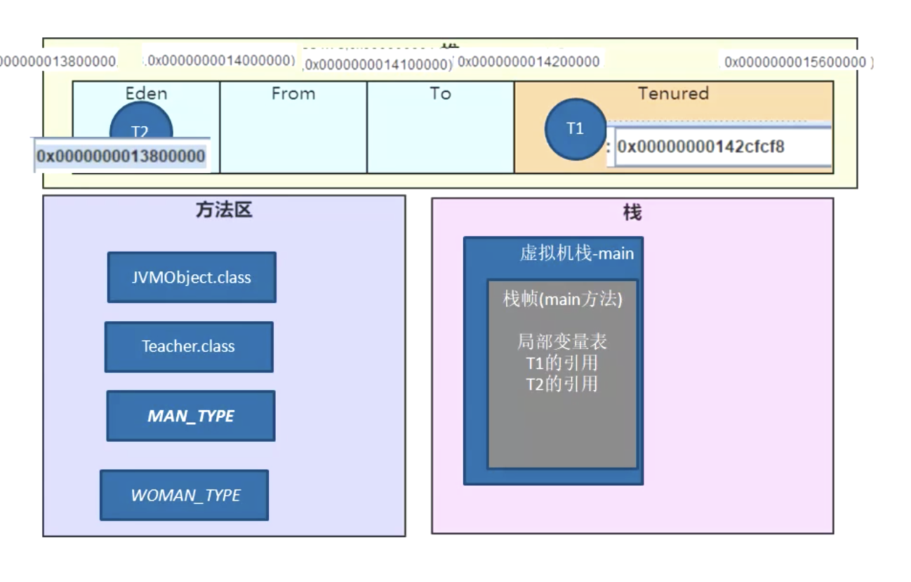

## 【B】Java -- JVM原理


### 输出倒逼输入

- Java程序启动过程（5个过程）；
- Java内存回收机制（包括回收算法）；
- jvm线程私有的有哪些

- **java类加载过程，ClassLoader 的双亲委派机制**
- 内存中堆与栈的区别，什么时候在栈中什么时候在堆中
- java gc是如何回收对象的，可以作为gc根节点的对象有哪些？
-  jvm的内存模型是什么样的？如何理解java的虚函数表？
- **引用，（强、弱、软、虚，以及之间的异同）**


### JVM 运行时数据区

Java虚拟机在指定Java程序的过程中会把它所管理的内存划分为若干个不同的数据区域。其中线程共享的**方法区（运行时常量区）、堆** ；线程私有的**虚拟机栈、本地方法栈、程序计数器**。 


#### 程序计数器

当前线程正在执行Java方法的时候，计数器值为正在执行的字节码指令的地址。如果正在执行的是native方法，那这个计数器值为空。


> why 程序计数器?

 1）时间片轮转，当线程被挂起，需要程序计数器保存程序执行现场；

 2）条件、循环、异常处理，也需要借助程序计数器实现


程序计数器很小，它是JVM内存区域中唯一不会OOM的区域。


#### 虚拟机栈

存储**当前线程运行方法所需的数据，指令、返回地址。**

类比手枪的一个弹夹。


##### 栈帧

每个方法生成一个栈帧。压入当前线程自己的虚拟机栈。

栈帧就类比弹夹里的一个个子弹。


- **局部变量表**

  局部变量 -- 8大基础数据类型、引用（真正的对象放在堆里）。

  

- **操作数栈**

  存放方法的执行和操作.

  > JVM字节码指令集 助记符

  https://cloud.tencent.com/developer/article/1333540

  操作数栈可以存放任意Java数据类型包括long和double。

  iadd指令：将操作数栈中栈顶，两个元素弹出，执行加法运算并将结果重新压回操作数栈。


- **动态连接**

  多态处理：静态分派、动态分派

  通过动态连接实现Java 多态特性，运行时调用到重载方法。读到方法调用的指令，根据参数类型，到class常量池寻找匹配的方法签名符号。

- **完成出口（返回地址）**

  正常返回 -- 调用者的程序计数器数值，作为返回地址

  异常返回 -- 异常处理器表

  


#### 本地方法栈

保存native方法的信息。当一个JVM创建的线程调用native方法后，JVM不再为其在虚拟机栈中创建栈帧，JVM只是简单地动态链接并直接调用native方法。


#### 方法区

- 类信息

- 常量

- 静态变量

- 即时编译器编译后的代码

  

JDK 1.7 时代叫永久代（受制于堆大小）

> 堆内存大小设置参数：

```
-Xmx 堆区内存可被分配的最大上限
-Xms 堆区内存初始内存分配大小
```


JDK 1.8 之后叫元空间，使用机器内存，不受限制；

坏处是挤压堆空间，-Xmx、-Xms参数失效

JDK 1.8 之后字符串仍放在堆中


> **直接内存**
>
> 直接内存不是JVM运行时数据区的一部分，也不是Java、虚拟机规范定义的存储区域。
>
> 如果使用了NIO，这块区域会被频繁使用，在Java堆内可以用directByteBuffer对象直接引用并操作；
>
> 这块内存不受Java堆大小限制，但受本机总内存限制，可以通过MaxDirectMemorrySize来设置（默认与堆内存最大值一样），所以也会有OOM。


#### Java堆

- 对象实例（几乎所有）

- 数组


堆进一步化分：


不同区域存放不同生命周期的对象，应用不同垃圾回收算法，提高垃圾回收效率


#### 从底层深入理解运行时数据区

```

```



##### HSDB可视化工具查看运行时数据区


#### 内存溢出

##### 虚拟机栈

StackOverFlow ：当线程请求栈深度超出虚拟机栈深度限制

OOM ：虚拟机栈动态扩展到无法申请足够内存


##### 堆：

OOM：


##### 方法区

元空间不足


##### 直接内存（堆外内存）


> StackOverFlow与OOM的区别？分别发生在什么时候，JVM栈中存储的是什么？堆中存储是什么？


#### 虚拟机优化技术

##### 编译优化技术

- 方法内联

  ​	两个虚拟机栈栈帧共享一部分区域


##### 栈优化技术


### JVM对象与垃圾回收机制


#### 虚拟机中对象创建的过程


### JVM类加载机制