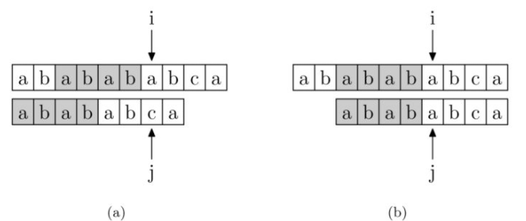
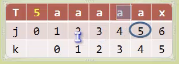

## 【B】00_字符串问题


### 字符串问题集合

- **KMP算法**

- 求两个字符串最长连续公共序列，查找最长子串
- 给定一个字符串（只有小写字母）和m步操作，每一步操作可以把相邻两个字符交换位置，问最多执行m步操作后，字符串中最长连续相同字符的长度是多少
- **给定一个只包括 ‘(’，’)'的字符串，判断字符串是否有效。注：空字符串属于有效字符串**

示例 1:输入: "(())"输出: true   实例 2： 输入: "())("输出: false

https://www.toutiao.com/a6772138712785486350/


### 模式匹配算法


#### 暴力匹配

基本思想是：

1. 从主串的第一个字符起与子串的第一个字符进行比较，若相等，则继续逐对字符进行后续的比较；

2. 若不相等，则从主串第二个字符起与子串的第一个字符重新比较，以此类推，
   直到子串中每个字符依次和主串中的一个连续的字符序列相等为止，此时称为匹配成功。

3. 如果不能在主串中找到与子串相同的字符序列，则匹配失败。

   

```java
public static int bruteForce(String s,String p) {
	int index = -1; //成功匹配的位置，匹配不到返回-1
	int sLength = s.length();
	int pLength = p.length();
	if(sLength < pLength) {
		 System.out.println("Error.The main string is greater than the sub string length.");
		return -1;
	}
	int i = 0;//当前遍历主串的下标
	int j = 0;//当前遍历字串的下标
	//暴力遍历串
	while(i < sLength && j < pLength)  {
		if(s.charAt(i) == p.charAt(j)) {
			//字符相等，指针后移
			i++;
			j++;
		}else {
			//主串回到上次匹配的字符的下一个字符，子串从0开始
			i = i - j + 1;//主串需要归还i向前走的j步，然后加1
			j = 0; //子串无须关注向前走了多少步，直接归零
		}
	}
	
	if(j == pLength) { //匹配成功
		index = i - j;
		System.out.println("Successful match,index is:" + index);
	} else {// 匹配失败
        System.out.println("Match failed.");
    }
	return index;
}
```


#### KMP算法

KMP的核心思想是主串不回溯。模式串少回溯。


##### 真前缀和真后缀

”Harry”的真前缀包括{”H”, ”Ha”, ”Har”, ”Harr”}

”Potter”的真后缀包括{”otter”, ”tter”, ”ter”, ”er”, ”r”}

字符串既是自身的前缀也是自身的后缀，不包含自身的，则称为真前缀和真后缀。


#####  PMT 表 与  next数组

实现KMP算法的核心在于PMT （部分匹配表，Partial Match Table）这个数据结构。对于字符串“abababca” ，它的PMT如下表示：

| char | a    | b    | a    | b    | a    | b    | c    | a    |
| ---- | ---- | ---- | ---- | ---- | ---- | ---- | ---- | ---- |
| i    | 0    | 1    | 2    | 3    | 4    | 5    | 6    | 7    |
| PMT  | 0    | 0    | 1    | 2    | 3    | 4    | 0    | 1    |

**PMT 中记录的是模式串“abababca”  截止index位置的子串，即[0,index]区间内构成的子串，前缀集合与后缀集合的交集中最长元素的长度。** 例如：i = 4处，子串为“ababa”  ，前缀集合{"a","ab","aba,"abab"}, 后缀集合 {"baba","aba","ba","a"} , 该处PMT值就为“aba”的长度3.

为了方便失配时回溯， 我们不直接使用PMT数组，而是将PMT数组向后偏移一位。我们把新得到的这个数组称为next数组。在把PMT进行向右移时，第0位的值，我们将其设成了-1，i 对应的值，就是 i 处的字符之前的子串，前后缀最大交集元素个数，假设是m。**这样，一旦在 i 位置发生失配（该位置之前都是匹配成功的），不需要从模式串头再重新匹配，而是“跳过”前面 m个元素的长度，或者说模式串向右移动 i- m 位，然后接着比较。**


next数组：

| char | a    | b    | a    | b    | a    | b    | c    | a    |      |
| ---- | ---- | ---- | ---- | ---- | ---- | ---- | ---- | ---- | ---- |
| i    | 0    | 1    | 2    | 3    | 4    | 5    | 6    | 7    |      |
| PMT  | 0    | 0    | 1    | 2    | 3    | 4    | 0    | 1    |      |
| next | -1   | 0    | 0    | 1    | 2    | 3    | 4    | 0    |      |


例如在 i= 4处 字符 ‘a’ 失配，对应的next[4] = 2 表示   "abab" 前后缀最大公共子集长度为2，即{"a","ab","aba"} ∩ {“bab”,"ab","b"} = "ab" 。模式串回溯、新一轮比较时，0，1位置的“ab” 就直接略过比较，从i=2位置开始。从效果上看，就是前缀的“ab” ，移动到了后缀"ab" 的位置。




```java
public static void kmp(String s ,String p) {
	int[] next = buildNext(p);//姑且设定有个函数，可以提供next[]数组，告知失配时模式串最多右移位数
	int index = -1;//返回成功匹配的位置，没查找到返回-1
	int sLength = s.length();
	int pLength = p.length();
	if(sLength < pLength) {
		return;
	}
	int i = 0;
	int j = 0;
	while(i < sLength && j <pLength) {
        // j==-1 处理第0个位置的元素失配的情况
		if(j == -1 || s.charAt(i) == p.charAt(j)) {
			i++;
			j++;
		}else {
      // 主串 i 不变
			j = next[j];//表示在j位置失配时，查找一下next表中记录的，前后缀相交个数，作为下次匹配时的起始下标。
		}
	}
	if(j >= pLength) {
		 index = i -j;
		 System.out.println("KMP Successful match,index is:" + index);
	}else {
		 System.out.println("Match failed.");
	}
	long endTime = System.currentTimeMillis();
	System.out.println("KMP cost time = "+(endTime - beginTime));
}
```


每个字符串都有固定的next数组，它可以看作是字符串本身关于前后缀的一种特性。但是怎么通过程序得出模式串的这种特性 -- 构造出next数组呢？


对于位置i ， 其前缀是固定的，后缀是相对的。

因为，前缀第一个字符固定是从0开始的，

而变量 i 对应的字符，表示的是后缀第一个字符，也就是最小真后缀。

前缀 j 即 i-1 从0开始与之匹配，理想状态下，最大真前缀与最大真后缀完全相同的，比如串 “aaaaaa”  ,  j一直指向最大真前缀最后一个字符 ， 可以一直递增，即next[i] 可以一直递增。如果失配，表示最大真前缀与最大真后缀不匹配了， 要退而求其次 ， 仍通过kmp的算法思想，回溯尝试找到次大真前缀与之匹配，直到j 回溯为 0，如果仍然匹配失败，说明最小真前缀与最小真后缀不匹配，本轮查找前后缀公共子集结束。

```java
	//构造next表
 private static int[] buildNext(String p) {
        int pLength = p.length();
        int[] next = new int[pLength]; //next数组跟串本身是等长的
        next[0] = -1; // 把第0 位置空出来，直接赋值 -1 ；从而实现PMT表右移；
        int i = 0; //  前缀
        int j = -1; // 后缀
        while (i < pLength - 1) {
            if (j == -1 || p.charAt(i) == p.charAt(j)) {//匹配结果存到next[i++]位置
                i++;
                j++;
                next[i] = j; // next[1] = 0；后缀第二个字符 i = 1 与 前缀第一个字符 j = 0 ，根据next表的定义，仍记入0
                             // next[i] : 连续匹配成功， i 位置之前，连续匹配成功字符数
            } else {
                j = next[j]; // 如果失配，按照kmp算法思想，取出j处字符之前的字串，前后缀最大交集数，再与i位置字符（最小真后缀）比较，
            }
        }
        return next;
    }
```


#### KMP算法的改进

对于特殊模式串，x处发生失配，但是子串“aaaaa” 前缀后缀都是相同，按照之前j=next[j] ,那 j 就要5，4，3，2，1这样依次回溯比对，这是没有必要的。新一轮应直接从头开始比对。




```java
	//构造next表
  public static int[] buildNext(String p) {
        int pLength = p.length();
        int[] next = new int[pLength];
        next[0] = -1; // 把第0 位置空出来，直接赋值 -1 ；从而实现PMT表右移；
        int i = 0; //  后缀
        int j = -1; // 前缀
        while (i < pLength - 1) {
            if (j == -1 || p.charAt(i) == p.charAt(j)) {
                i++;
                j++;
                if (p.charAt(i) != p.charAt(j)) { //
                    next[i] = j;
                } else {
                    next[i] = next[j];
                }
            } else {
                j = next[j]; // 如果失配，取出成功上轮匹配成功时保存的数，子串回溯到 next[j]
            }
        }
        for (int index = 0; index < next.length; index++) {
            System.out.println(" " + index + " = " + next[index]);
        }
        return next;
    }
```


