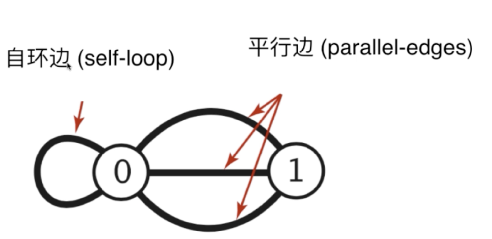
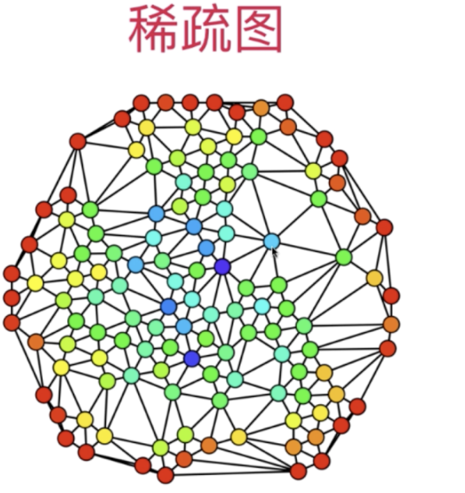
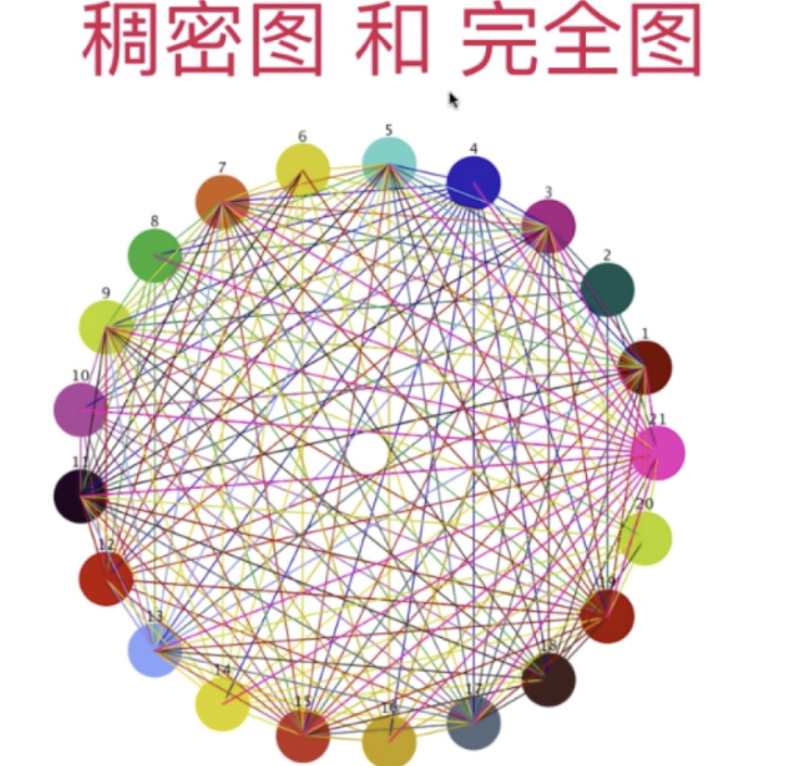
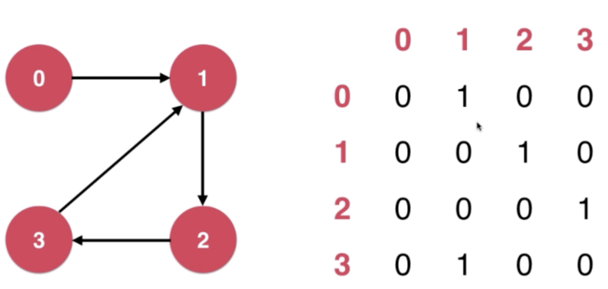
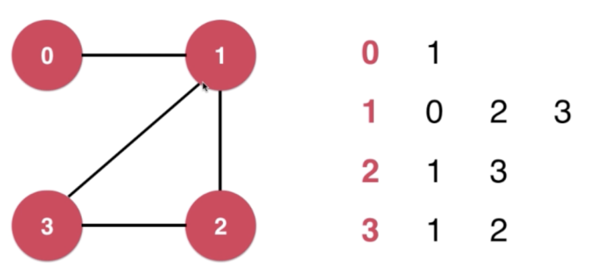

## 【B】算法 -- 图论

### 输出倒逼输入

- 最小生成树


### 数据结构 -- 图

##### 有向图、无向图

##### 有权图、无权图

##### 连通性、联通分量

对于图上两点，如果有路径两者相连，那么这两点是**连通的**。

如果无向图上任意两点，都是连通的，那它是一张**连通图**。

如果一张图不是连通的，那么互不连通的子图数量称为**联通分量**。


一张图中，不连通的组成部分


##### 自环边、平行边



自环边：节点自己连接自己的边

平行边：两条或多条连接两个相同节点的边。


##### 稀疏图（Sparse Graph）、稠密图（Dense Graph）



大体来看，一个节点拥有的边的个数，远远小于总节点数。用邻接表表示更高效。





### 图的表示


#### 邻接矩阵




##### 示例 -- 用邻接矩阵表示 稠密图

```

```


#### 邻接表



比邻接矩阵需要空间更少。


**邻接表更适合表示稀疏图，邻接矩阵适合表示稠密图**


##### 示例 -- 用邻接表表示 稀疏图

```

```


### 深度优先遍历

从一点开始，不回头走下去，需要记录已遍历过的节点


### 广度优先遍历


### 最小生成树

对于一个有V个顶点，连通的、带权图，找出一个由V-1条边 构成的总权值最小的树。


**切分定理**：

横切边中权值最小的边，一定是属于这个图最小生成树的一条边


#### Prim算法 

##### Lazy Prim算法


##### Prim算法


#### Kruskal 算法


### 最短路径算法 

#### Dijkstra 算法


#### Bellman - Ford算法


