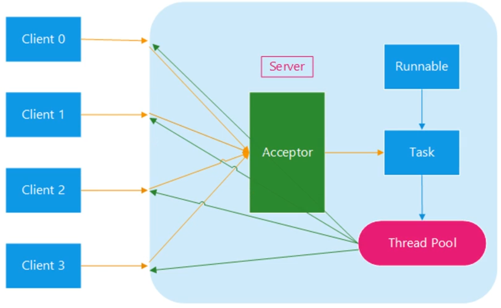
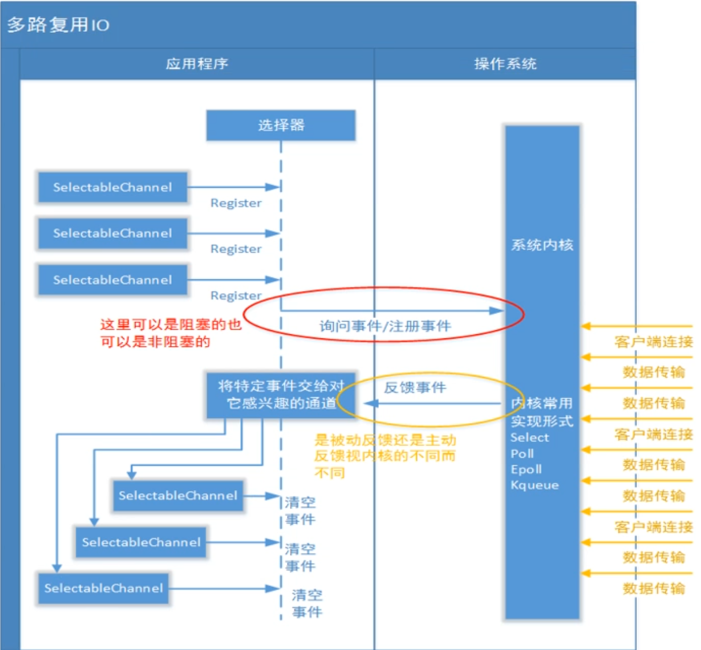

## 【B】java -- NIO 与 网络编程


### 计算机网络知识体系回顾

#### TCP/IP 协议族

OSI 七层模型实践中比较难实现。

重点关注TCP/IP 四层网络模型：


##### 基于TCP/IP四层模型，一次网络通信的基本过程。


##### TCP链接三次握手。为什么需要三次握手？


第一次握手：客户端将标志位SYN置为1，随机产生一个值seq=j，并将数据包发送给服务端，客户端进入SYN_SENT状态，等待服务端确认。

第二次握手：服务端收到数据包后，由标志位SYN=1知道客户端是想请求建立连接，服务端将标志位SYN和ACK都置为1，ack = J+1，随机产生一个seq=K，并将该数据包发送给客户端以确认连接请求。此时服务端处于SYN_RCVD状态。

第三次握手：客户端收到确认后，检查ack是否为J+1，ACK是否为1，如果正确则将标志位ACK置为1，ack=K+1，并将该数据包发给服务端，服务端检查ack是否为k+1，ACK是否为1，如果正确则连接成功，服务端和客户端都进入ESTABLISHED状态，完成三次握手。

> 为什么需要三次握手？

TCP是面向连接的可靠传输协议，需要双方都确认连接的建立。

在TCP协议RFC793中解释了必须是三次握手的原因：

为了实现可靠传输，TCP协议通信双方都必须维护一个序列号，以标识发出去的数据包中哪些是已经被对方接收到的。三次握手的过程即是**双方相互告知序列号起始值，并确认对方已经收到了序列号起始值的必经步骤。**如果是两次握手，那只能发起方起始系列号能被确认。


##### TCP连接的三次握手的漏洞 -- SYN洪泛攻击

第二次握手，服务端向客户端应答请求，应答请求是需要客户端IP的，攻击者就伪造这个IP，从而使服务端忙于进行第二次握手并等待回应，导致服务端被拖累、死机。

解决方法：

1. 无效链接监视释放法

   不停监视所有连接，达到一定阈值时拆除这些连接，不管是正常的还是攻击的。

2. 延缓TCB分配法

   一般做完第一次握手之后，服务器就需要为该请求分配一个TCB（连接控制资源，通常占200多个字节）。延迟TCB分配，当正常连接建立起来后再分配TCB则可以有效减轻服务器资源消耗。

3. 使用防火墙

   防火墙确认连接有效性后，才向内部服务器（Listener）发起SYN请求。


DDos 攻击是发送大量合法的请求 ，占用带宽（带宽攻击）导致合法用户无法获得服务。


##### TCP中的四次挥手

处于ESTABLISHED状态的通信双方，都可以发起主动关闭连接。假设客户端是主动关闭端：


1. 发送FIN报文表示不再有数据要发送（但仍可以接收），并进入FIN_WAIT_1状态；

2. 服务端要立即给予ACK应答，并进入CLOSE_WAIT状态；
3. 客户端收到确认报文后，进入FIN_WAIT_2状态；
4. 一段时间后，作为被动关闭方，将调用close关闭套接字。这也将导致它的TCP也发送FIN报文，进入LAST_ACK状态，等待主动关闭方最后确认；
5. 客户端收到FNI后，发送ACK报文予以确认。同时进入TIME_WAIT阶段。等待2MSL后，才撤销TCB关闭TCP连接。
6. 而被动关闭方（服务端）立即进入CLOSE状态，撤销TCB，结束TCP连接。


> 为什么挥手要4次？

TCP是全双工，通信双方都可以互相发送和接收请求，所以需要4次通信，双方都要告知对方自己没有数据要发送了并且要求对方确认收到。

> 2和3可不可以合并？

有合并的场景，服务端后续没有数据要发给客户端时，

> 为社么有TIME_WAITING?

1. 等待2*MSL时间，确保报文数据完全接收到，可靠的终止TCP连接
2. 如果不存在这个TIME_WAIT，别的应用可能建立起IP和端口相同的连接，它就可能收到上个连接的TCP报文段，这显然不合理。


##### TCP的粘包/拆包特性及解决办法？

数据链路层限制数据包1460B大小。

nagle算法 将多个小包 合成一个包，一起发送的情况。

1. 消息头+消息体形式，消息头标识消息体长度

2. 消息定长不管什么消息，固定长度比如10字节；

3. 特殊分隔符，比如回车换行符


##### 什么应用适合用UDP实现？丢包怎么处理？

海量数据，高速带宽适合用UDP。

上层应用自己来实现可靠性传输 类似Http3 基于的 QUIC协议  


##### 如何评价序列化机制好坏 -- 为什么JDK提供的Serializable序列化机制不好？

1.序列化之后码流大小 

2.性能

3.是否能跨语言

ProtoBuf 优于 JSON 优于 xml 


##### 网络工具Wireshark和tcpdump

捕获过滤器

捕获菜单-输入条件（BPF语法 dst host 192.168.0.10 && tcp port 80）

显示过滤器


#### HTTP协议

##### DNS劫持和HTTP劫持

使用运营商的DNS服务器，域名解析到非正常页面

解决：

自己搭建DNS服务器

HTTP防劫持思路：

1. Https协议加密请求
2. 使用对称加密算法加密整个url


### Java原生网络编程


##### Socket

类似于门面模式，是应用层与 TCP/IP 协议族通信的中间软件抽象层。

短连接：短连接是指 SOCKET 连接后发送后接收完数据后马上断开连接。

长连接：长连接指建立 SOCKET 连接后不管是否使用都保持连接。


##### 网络编程核心业务

1. 连接（客户端、服务器）
2. 读网络数据
3. 写网络数据


#### 实现网络编程的形式

##### **BIO（Blocking IO）**

传统的BIO通信模型通常由一个独立的 Acceptor 线程负责监听客户端的连接，它接收到客户端连接请求之后为每个客户端创建一个新的线程进行链路处理，处理完后通过输出流返回应答给客户端，线程销毁。**一个线程对应一个连接。**典型的一请求一应答模型，数据的读取写入也必须阻塞在一个线程内等待其完成。




Socket负责客户端

```
/**
 *类说明：Bio通信的客户端
 */
public class Client {

    public static void main(String[] args) throws IOException {
        //客户端必备
        Socket socket = null;
        ObjectInputStream inputStream = null;
        ObjectOutputStream outputStream = null;
        InetSocketAddress serverAddr = new InetSocketAddress("127.0.0.1",10001);

        try {
            socket = new Socket();
            socket.connect(serverAddr);

            outputStream = new ObjectOutputStream(socket.getOutputStream());
            inputStream = new ObjectInputStream(socket.getInputStream());

            outputStream.writeUTF("Lance");
            outputStream.flush();

            System.out.println(inputStream.readUTF());
        } finally {
            if(socket!= null) socket.close();
            if(outputStream!=null ) outputStream.close();
            if(inputStream!=null ) inputStream.close();
        }
    }
}
```

ServerSocket负责服务端。

```
/**
 *类说明：Bio通信的服务端
 */
public class ServerPool {

    private static ExecutorService executorService = Executors.newFixedThreadPool(
            Runtime.getRuntime().availableProcessors()*2);

    public static void main(String[] args) throws IOException {
        //服务端启动必备
        ServerSocket serverSocket = new ServerSocket();
        //表示服务端在哪个端口上监听
        serverSocket.bind(new InetSocketAddress(10001));
        System.out.println("Start Server ....");
        try{
            while(true){
                executorService.execute(new ServerTask(serverSocket.accept()));
            }
        }finally {
            serverSocket.close();
        }
    }

    //每个和客户端的通信都会打包成一个任务，交个一个线程来执行
    private static class ServerTask implements Runnable{

        private Socket socket = null;
        public ServerTask(Socket socket){
            this.socket = socket;
        }

        @Override
        public void run() {
            //实例化与客户端通信的输入输出流
            try(ObjectInputStream inputStream =
                    new ObjectInputStream(socket.getInputStream());
                ObjectOutputStream outputStream =
                    new ObjectOutputStream(socket.getOutputStream())){

                //接收客户端的输出，也就是服务器的输入
                String userName = inputStream.readUTF();
                System.out.println("Accept client message:"+userName);

                //服务器的输出，也就是客户端的输入
                outputStream.writeUTF("Hello,"+userName);
                outputStream.flush();
            }catch(Exception e){
                e.printStackTrace();
            }finally {
                try {
                    socket.close();
                } catch (IOException e) {
                    e.printStackTrace();
                }
            }
        }
    }
}
```


##### **NIO（no-blocking IO多路复用）**

NIO与BIO区别：

1. BIO是阻塞的，NIO非阻塞

   Java IO的各种流是阻塞的，这意味着当一个线程调用read()或write()时，该线程被阻塞，直到有数据被读写。该线程在此期间不能再干任何事情。NIO为非阻塞模式，当没有数据读写的时候，线程通常将时间用于其他通道上执行IO操作名，即一个单独的线程可以管理多个IO通道。

2. BIO面向流，NIO机制是基于订阅事件、面向缓冲区的

NIO三大组件：**Selector选择器、Channel管道、buffer缓冲区**。





**SelectionKey**

**SelectionKey**中定义了4种事件OP_READ、OP_WRITE、OP_CONNECT、OP_ACCEPT；


**Selector选择器**

Selector 的英文含义是“选择器”，也可以称为为“轮询代理器”、“事件订阅器”、 “channel 容器管理机”都行。应用程序将向 Selector 对象注册需要它关注的 Channel，以及具体的某一个 Channel 会对哪些 IO 事件感兴趣。Selector 中也会维护一个“已经注册的 Channel” 的容器。


**Channel管道**

客户端 SocketChannel，

服务端 ServerSocketChannel，

通道，被建立的一个应用程序和操作系统交互事件、传递内容的渠道(注意 是连接到操作系统)。那么既然是和操作系统进行内容的传递，那么说明应用程 序可以通过通道读取数据，也可以通过通道向操作系统写数据，而且可以同时进 行读写。

- 所有被 Selector(选择器)注册的通道，只能是继承了 SelectableChannel 类的子类。

-  ServerSocketChannel:应用服务器程序的监听通道。只有通过这个通道， 应用程序才能向操作系统注册支持“多路复用 IO”的端口监听。同时支持 UDP 协议和 TCP 协议。

-  ScoketChannel:TCP Socket 套接字的监听通道，一个 Socket 套接字对应了 一个客户端 IP:端口 到 服务器 IP:端口的通信连接。

  通道中的数据总是要先读到一个 Buffer，或者总是要从一个 Buffer 中写入。


**Buffer**

ByteBuffer实际上就是包装了一个数组。三个指针 position、limit、capacity

读写模式切换 flip()


Buffer内存分配

ByteBuffer.allocate() // 堆上分配

ByteBuffer.allocateDirect() //使用直接内存分配


数据流向


向buffer中写数据两种场景：

* 读取Channel写到buffer
* 通过Buffer的put()方法

使用 Buffer 读写数据常见步骤 

1. 写入数据到Buffer
2. 调用flip()方法
3. 从Buffer中读取数据
4. 调用clear()方法或者compact()方法，准备下一次的写入
    当向 buffer 写入数据时，buffer 会记录下写了多少数据。一旦要读取数据，

需要通过 flip()方法将 Buffer 从写模式切换到读模式。在读模式下，可以读取之 前写入到 buffer 的所有数据。

一旦读完了所有的数据，就需要清空缓冲区，让它可以再次被写入。有两种 方式能清空缓冲区:调用 clear()或 compact()方法。clear()方法会清空整个缓冲区。 compact()方法只会清除已经读过的数据。


##### NIO 之 单线程 Reactor（反应器）模式

Selector 反应器

ServiceChannel向Selector注册感兴趣的事件，但是单线程模式存在效率问题


##### NIO 之 单线程 Reactor + 工作者线程池模式

Reactor线程只负责accept() 、read()、write()、connect()操作，将非IO操作从Reactor线程中移出来交给工作线程池来执行，不至于因为一些耗时的业务逻辑而延迟对后面的IO请求的处理。


一个线程面对高并发或大数据量的场景仍然是有性能问题。


##### NIO 之 多线程 Reactor 模式


##### Reactor模式 与 观察者模式 区别？

观察者事件源只有一个，事件发生时，观察者全部收到通知。

Reactor模式 事件源有多个，每个观察者关注的事件不一样的，事件发生时，反应器只会通知对事件感兴趣的观察者。


##### select、poll 、epoll的区别？

select、poll和epoll都是操作系统实现IO多路复用的机制。I/O多路复用就通过一种机制可以监视多个描述符，一旦某个描述符就绪（一般是读就绪或写就绪），能够通知程序进行相应读写操作。三者区别：

1.支持一个进程所能打开的最大连接数

| select | 单个进程所能打开的最大连接数有FD_SETSIZE宏定义，其大小是32个整数的大小（在32位的机器上，大小就是32*32，同理64位机器上FD_SETSIZE为32*64），当然我们可以对进行修改，然后重新编译内核，但是性能可能会受到影响。 |
| ------ | ------------------------------------------------------------ |
| poll   | poll本质上和select没有区别，但是它没有最大连接数的限制，原因是它是基于链表来存储的 |
| epoll  | 连接数基本上只受限于机器的内存大小                           |

2.FD剧增后带来IO效率问题

| select | 因为每次调用时都会对连接进行线性遍历，所以随着FD的增加会造成遍历速度慢的“线性下降性能问题”。 |
| ------ | ------------------------------------------------------------ |
| poll   | 同上                                                         |
| epoll  | 因为epoll内核中实现是根据每个fd上的callback函数来实现的，只有活跃的socket才会主动调用callback，所以在活跃socket较少的情况下，使用epoll没有前面两者的线性下降的性能问题，但是所有socket都很活跃的情况下，可能会有性能问题。 |

3.消息传递方式

| select | 内核需要将消息传递到用户空间，都需要内核拷贝动作 |
| ------ | ------------------------------------------------ |
| poll   | 同上                                             |
| epoll  | epoll通过内核和用户空间共享一块内存来实现的。    |


> 什么是水平触发、什么是边缘触发？
>


##### 直接内存深入辨析

###### 直接内存比堆内存块在哪里？

直接内存GC管不着，如果在堆上申请buffer，需要二次拷贝到直接内存。再拷贝到内核的套接字缓冲区。


##### 零拷贝技术


Linux 支持的常见零拷贝技术 -- MMap 

硬盘上文件的位置和应用程序缓冲区(application buffers)进行映射（建立一种一一对应关系），由于mmap()将文件直接映射到用户空间，所以实际文件读取时根据这个映射关系，直接将文件从硬盘拷贝到用户空间，只进行了一次数据拷贝，不再有文件内容从硬盘拷贝到内核空间的一个缓冲区。


3次拷贝，4次上下文切换


Linux 支持的常见零拷贝技术 -- sendfile


3（2）次拷贝，2次上下文切换


***NIO\*****提供的内存映射** ***MappedByteBuffer\***

NIO中的FileChannel.map()方法其实就是采用了操作系统中的内存映射方式，底层就是调用Linux mmap()实现的。

将内核缓冲区的内存和用户缓冲区的内存做了一个地址映射。这种方式适合读取大文件，同时也能对文件内容进行更改，但是如果其后要通过SocketChannel发送，还是需要CPU进行数据的拷贝。

***NIO\*****提供的*****sendfile\***

Java NIO 中提供的 FileChannel 拥有 transferTo 和 transferFrom 两个方法，可直接把 FileChannel 中的数据拷贝到另外一个 Channel，或者直接把另外一个 Channel 中的数据拷贝到 FileChannel。


### Linux系统和JDK对网络通信的实现

#### Linux下五种I/O模型

##### 阻塞I/O

##### I/O多路复用

​	一个线程管理多个通道（Socket）

##### 非阻塞式I/O

​	大量占用CPU

##### 信号驱动I/O

​	有数据来，发送信号

##### 异步I/O


#### JDK中BIO实现分析


Socket真正实现类SocksSocketImpl，bind()、listen()


#### Linux下的I/O复用编程机制

select、poll、epoll都是IO多路复用机制。即**一个进程可以监听多个描述符，一旦某个描述符就绪（一般是读就绪或写就绪），能够通知程序进行相应读写操作。**


Linux中一切皆对象，每个socket也对应着文件描述符列表中的一个fd，每个Socket都有发送缓冲区、接收缓冲区、等待列表。


##### select

优点：几乎所有平台都支持。

缺点：单进程能够监视的文件描述符最大Linux上是1024个。

select实现思路简单直接：假如进程A同时监视sock1，sock2，sock3三个socket调用select()之后，进程A进入等待状态，操作系统内核将其从工作队列移出（不再占用CPU），并加到这三个socket的等待列表中。

当任何一个网卡收到数据包，通过端口找到socket，数据存到其接收缓冲区，中断程序将唤起进程，即将进程加到内核工作队列中，并从所有等待队列中移除。进程A唤醒后，遍历一遍socket列表，就可以得到就绪的socket。


select主要问题有两点：

1.每次调用select都要将进程加入到所有被监视的socket的等待队列中，然后每次唤醒又要再移除。都要进行遍历。也正因遍历开销大，才规定默认只监视1024个socket。

2.进程被唤醒后，不知道确切哪个socket收到数据，要通过遍历它监听的socket fd列表来找。select是系统调度，属于内核态，监听的socket fd列表从用户态传到内核态，性能也有影响。

##### poll

没有最大数量限制。但连接数量增加，效率效率急剧降低。内部采用链表，遍历很慢。


##### epoll机制

 int epoll_create(int size); //创建epoll句柄，占用一个fd值（文件描述符）
 int epoll_ctl(int epfd, int op, int fd, struct epoll_event *event);//添加或删除要监听的socket
 int epoll_wait(int epfd, struct epoll_event * events, int maxevents, int timeout);//阻塞等待事件


epoll设计思想是功能拆分：

epoll_create 单独创建文件描述符 -- epfd，

要监听的socket列表是相对稳定的，只需调用一次epoll_ctl 将socket的文件描述符从用户态传到内核态，添加到epfd。

再调epoll_wait阻塞进程，只将一个有数据产生的socket返回回来。


##### epoll高效原理和底层机制分析

##### 


epoll_create 将在内核里创建eventpoll （也对应一个文件描述符即epfd）。

epoll_ctl 将要监听的socket与eventpoll挂钩 -- 添加到eventpoll中一个**监视池rbr（红黑树）**。

epoll_wait 函数调用时，进程A被放到eventpoll的**等待队列**。等待过程中，如果某个socket2有数据接收到，中断程序会给eventpoll对象里边的 就**绪列表 rdlist**中添加socket2引用，另一方面唤醒eventpoll等待队列中的进程，进程A再次进入运行状态，从rdlist 中直接可以获取到哪些socket发生了变化。

			 		 		 		 	

这样socket的数据接收就不直接影响进程，而是通过改变eventpoll的就绪列表来改变进程状态。

当程序进行到epoll_wait时，如果rdlist 已经引用了socket，那么epoll_wait直接返回，如果rdlist为空，则阻塞进程。


eventpoll 用红黑树维护Socket列表 ，

就绪队列应该使用适于快速插入和删除的数据结构 事实上，rdlist的实现是双向链表 。


#### JDK中NIO实现分析


