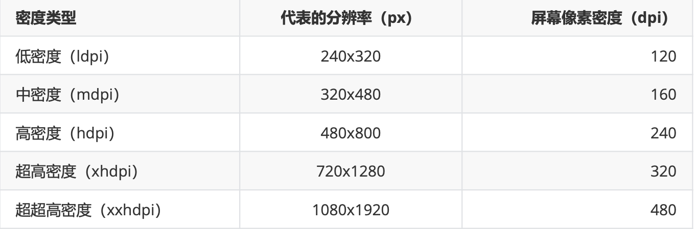

## 【P】项目性能优化与适配


### 一、性能优化


#### 内存优化

<u>*@link ART内存管理 -- 内存分配释放与垃圾回收GC*</u>

##### 面试要点

- 内存泄露的分类。**什么么情况会导致内存泄漏如何修复？**
- **下载一张很大的图，如何保证不 oom？**

 \- [Android性能优化（五）之细说Bitmap](https://www.jianshu.com/p/e49ec7d053b3)

- 一张图片100*100的图片在内存中的大小
- 以handler匿名内部类做例子讲。泄露链是怎样的。
- leakcanary原理。
- 为什么会出现抖动，为什么要做抖动的检查，有啥用，
- 线上有泄露，怎么收集，排查，设计方案。


##### 内存泄漏


##### 内存抖动案例


##### 内存溢出（OOM）


##### Bitmap优化


##### 工具使用与原理

- AS 自带Profile工具分析内存
- MAT工具使用
- LeakCanary原理
- 


#### 启动优化

<u>*@link【A】Framework原理-app启动过程与启动优化*</u>

##### 面试问题

- 【设计】设计一个工具，监控启动时间，粒度要求在方法级别。


#### 网络优化

*<u>@link【B】网络篇</u>*

##### 面试题

- 【设计】当你的服务商出现问题，设计一个网络请求可用性的兜底方案。

  >   大概从httpDNS，域名容灾等方面回答吧。

- 问网络优化，当网络带宽足够大，信号足够好，下载大文件，怎么快？

  开多个链接，wifi+4G同时，分片下。
  协议层 ，udp去下，本地做完整性校验，我记得qq客户端时这样做的。
  m3u8的思想去下。


#### 卡顿优化

一般主线程过多的UI绘制、大量的IO操作或是大量的计算操作占用CPU，导致16ms内未完成绘制，会是造成卡顿的原因。简单来说， Android使用消息机制进行UI更新，UI线程有个Looper，在其loop方法中会不断取出message，调用其绑定的 Handler在UI线程执行。如果在handler的dispatchMesaage方法里有耗时操作，就会发生卡顿。详细Android UI绘制流程移步：

*<u>@link 布局文件解析与View绘制过程</u>*

性能优化篇这里，重点讲项目中如何分析UI卡顿。


##### 卡顿排查工具

卡顿

Traceview和systrace 代表了卡顿排查工具的两个流派。

1. Systrace工具 进行丢帧分析与app卡顿检测

   一般用于页面中滑动操作，

   生成html报告，查看  Frames 记录， 帧与帧相隔时间大概16到17ms之间，圆点呈绿色。

   查看掉帧时段内，UI Thread 操作同时 CPU在做什么事情，导致的掉帧，比如 ext4_write 表示 同时有大量文件操作。

   

2. 使用AS 自带的profile 检查卡顿

   查看CPU Usage

   优点是可以查看选择的时段内方法调用栈

   

3. 代码监控方案1

   Looper msg.target.dispatchMessage的前打印了log，dispatch finish后又打印了log，只要算一下这个时间差，可以监控卡顿。

   ```
   public static void loop() { 
   for (;;) { //......
   Printer logging = me.mLogging; if (logging != null) {
   logging.println(">>>>> Dispatching to " + msg.target + " " +
   msg.callback + ": " + msg.what); }
   msg.target.dispatchMessage(msg); if (logging != null) {
   logging.println("<<<<< Finished to " + msg.target + " " + msg.callback); }
   //......
   } }
   ```

   

   

   Looper 预留了接口，设置自定义LogMonitor：

   ```
   public class LogMonitor implements Printer {
   
   
       private StackSampler mStackSampler;
       private boolean mPrintingStarted = false;
       private long mStartTimestamp;
       // 卡顿阈值
       private long mBlockThresholdMillis = 3000;
       //采样频率
       private long mSampleInterval = 1000;
   
       private Handler mLogHandler;
   
       public LogMonitor() {
           mStackSampler = new StackSampler(mSampleInterval);
           HandlerThread handlerThread = new HandlerThread("block-canary-io");
           handlerThread.start();
           mLogHandler = new Handler(handlerThread.getLooper());
       }
   
       @Override
       public void println(String x) {
           //从if到else会执行 dispatchMessage，如果执行耗时超过阈值，输出卡顿信息
           if (!mPrintingStarted) {
               //记录开始时间
               mStartTimestamp = System.currentTimeMillis();
               mPrintingStarted = true;
               mStackSampler.startDump();
           } else {
               final long endTime = System.currentTimeMillis();
               mPrintingStarted = false;
               //出现卡顿
               if (isBlock(endTime)) {
                   notifyBlockEvent(endTime);
               }
               mStackSampler.stopDump();
           }
       }
   
       private void notifyBlockEvent(final long endTime) {
           mLogHandler.post(new Runnable() {
               @Override
               public void run() {
                   //获得卡顿时主线程堆栈
                   List<String> stacks = mStackSampler.getStacks(mStartTimestamp, endTime);
                   for (String stack : stacks) {
                       Log.e("block-canary", stack);
                   }
               }
           });
       }
   
   
       private boolean isBlock(long endTime) {
           return endTime - mStartTimestamp > mBlockThresholdMillis;
       }
   
   
   }
   ```

   ```
   //获取内存栈状态信息
   public class StackSampler {
       public static final String SEPARATOR = "\r\n";
       public static final SimpleDateFormat TIME_FORMATTER =
               new SimpleDateFormat("MM-dd HH:mm:ss.SSS");
   
   
       private Handler mHandler;
       private Map<Long, String> mStackMap = new LinkedHashMap<>();
       private int mMaxCount = 100;
       private long mSampleInterval;
       //是否需要采样
       protected AtomicBoolean mShouldSample = new AtomicBoolean(false);
   
       public StackSampler(long sampleInterval) {
           mSampleInterval = sampleInterval;
           HandlerThread handlerThread = new HandlerThread("block-canary-sampler");
           handlerThread.start();
           mHandler = new Handler(handlerThread.getLooper());
       }
   
       /**
        * 开始采样 执行堆栈
        */
       public void startDump() {
           //避免重复开始
           if (mShouldSample.get()) {
               return;
           }
           mShouldSample.set(true);
   
           mHandler.removeCallbacks(mRunnable);
           mHandler.postDelayed(mRunnable, mSampleInterval);
       }
   
       public void stopDump() {
           if (!mShouldSample.get()) {
               return;
           }
           mShouldSample.set(false);
   
           mHandler.removeCallbacks(mRunnable);
       }
   
   
       public List<String> getStacks(long startTime, long endTime) {
           ArrayList<String> result = new ArrayList<>();
           synchronized (mStackMap) {
               for (Long entryTime : mStackMap.keySet()) {
                   if (startTime < entryTime && entryTime < endTime) {
                       result.add(TIME_FORMATTER.format(entryTime)
                               + SEPARATOR
                               + SEPARATOR
                               + mStackMap.get(entryTime));
                   }
               }
           }
           return result;
       }
   
       private Runnable mRunnable = new Runnable() {
           @Override
           public void run() {
               StringBuilder sb = new StringBuilder();
               StackTraceElement[] stackTrace = Looper.getMainLooper().getThread().getStackTrace();
               for (StackTraceElement s : stackTrace) {
                   sb.append(s.toString()).append("\n");
               }
               synchronized (mStackMap) {
                   //最多保存100条堆栈信息
                   if (mStackMap.size() == mMaxCount) {
                       mStackMap.remove(mStackMap.keySet().iterator().next());
                   }
                   mStackMap.put(System.currentTimeMillis(), sb.toString());
               }
   
               if (mShouldSample.get()) {
                   mHandler.postDelayed(mRunnable, mSampleInterval);
               }
           }
       };
   
   }
   
   ```

   

> blockcanary原理，目的

```
//封装一下
public class BlockCanary {
    public static void install() {
        LogMonitor logMonitor = new LogMonitor();
        Looper.getMainLooper().setMessageLogging(logMonitor);
    }
}
```


4. 代码监控方案2

   监听编舞者Choreographer 视图刷新间隔

```
public class ChoreographerHelper {

    static long lastFrameTimeNanos = 0;

    public static void start() {
        if (Build.VERSION.SDK_INT >= Build.VERSION_CODES.JELLY_BEAN) {
            Choreographer.getInstance().postFrameCallback(new Choreographer.FrameCallback() {

                @Override
                public void doFrame(long frameTimeNanos) {
                    //上次回调时间
                    if (lastFrameTimeNanos == 0) {
                        lastFrameTimeNanos = frameTimeNanos;
                        Choreographer.getInstance().postFrameCallback(this);
                        return;
                    }
                    long diff = (frameTimeNanos - lastFrameTimeNanos) / 1_000_000;
                    if (diff > 16.6f) {
                        //掉帧数
                        int droppedCount = (int) (diff / 16.6);
                    }
                    lastFrameTimeNanos = frameTimeNanos;
                    Choreographer.getInstance().postFrameCallback(this);
                }
            });
        }
    }
}
```


##### 卡顿优化手段

1. 减少布局层级

   AS自带的Layout Inspector

2. 使用include、merge、ViewStub标签

   > ViewStub的原理

   

3. **解决过度绘制**

   1）移除布局中不需要的背景。

   ​	  不必要的背景可能永远不可见，因为它会被应用在该视图上 绘制的任何其他内容完全覆盖。例如，当系统在父视图上绘制子视图时，可能会完全覆盖父视图的背 景。

   2）使视图层次结构扁平化。

   3）降低透明度。

   ​		对于不透明的 view ，只需要渲染一次即可把它显示出来。但是如果这个 view 设置了 alpha 值，则至 少需要渲染两次。这是因为使用了 alpha 的 view 需要先知道混合 view 的下一层元素是什么，然后再 结合上层的 view 进行Blend混色处理。透明动画、淡入淡出和阴影等效果都涉及到某种透明度，这就会 造成了过度绘制。可以通过减少要渲染的透明对象的数量，来改善这些情况下的过度绘制。例如，如需 获得灰色文本，可以在 TextView 中绘制黑色文本，再为其设置半透明的透明度值。但是，简单地通过 用灰色绘制文本也能获得同样的效果，而且能够大幅提升性能。

   

   > 设计检测过度绘制的工具，要具体到view。

   

   

   

4. **布局加载优化**

   移步加载方案

   LayoutInflater加载xml布局的过程会在主线程使用IO读取XML布局文件进行XML解析，再根据解析结果利用反射 创建布局中的View/ViewGroup对象。这个过程随着布局的复杂度上升，耗时自然也会随之增大。

   ```
   dependencies {
   implementation "androidx.asynclayoutinflater:asynclayoutinflater:1.0.0"
   }
   ```

   ```
   new AsyncLayoutInflater(this)
   .inflate(R.layout.activity_main, null, new AsyncLayoutInflater.OnInflateFinishedListener() { @Override
   public void onInflateFinished(@NonNull View view, int resid, @Nullable ViewGroup parent) {
              setContentView(view);
   //......
   } });
   ```

   几点需要注意：

   1. 使用异步 inflate，那么需要这个 layout 的 parent 的 generateLayoutParams 函数是线程安全的;

   2. 所有构建的 View 中必须不能创建 Handler 或者是调用 Looper.myLooper;(因为是在异步线程中加载的，异步线程默认没有调用 Looper.prepare );

   3. AsyncLayoutInflater 不支持设置 LayoutInflater.Factory 或者 LayoutInflater.Factory2;

   4. 不支持加载包含 Fragment 的 layout

   5. 如果 AsyncLayoutInflater 失败，那么会自动回退到UI线程来加载布局;

      

5. 掌阅X2C方案

   xml的解析涉及到大量耗时的反射操作，掌阅X2C方案是在编译生成APK期间，将需要的layout xml翻译生成对应的java文件。

   https://github.com/iReaderAndroid/X2C

   > 这一步在 gradle 构建的哪个阶段 ？


#### ANR

##### anr三种主要类型

- **KeyDispatchTimeout（常见）**

​	input事件在5S内没有机会得到处理或没有处理完成

​	logcat日志关键字：Input event dispatching timed out

- **BroadcastTimeout**

​	前台Broadcast：onReceiver在10S内没有处理完成发生ANR。

​	后台Broadcast：onReceiver在60s内没有处理完成发生ANR。

​	logcat日志关键字：Timeout of broadcast BroadcastRecord

- **ServiceTimeout**

​	前台Service：onCreate，onStart，onBind等生命周期在20s内没有处理完成发生ANR。

​	后台Service：onCreate，onStart，onBind等生命周期在200s内没有处理完成发生ANR

​	logcat日志关键字：Timeout executing service


##### 出现ANR常见原因

1:主线程频繁进行耗时操作：如数据库IO操作, 复杂布局解析渲染耗时

2:多线程操作的死锁，主线程被子线程同步锁block；log关键字查 “held by”、waiting to lock

3:主线程被Binder 对端block；

4:service binder的连接达到上线无法和和System Server通信

5:系统资源已耗尽（管道、CPU、IO）


##### ANR排查过程

  1.通过logcat，或者bugreport 确认anr发生的时间和进程，以及CPU负载情况。

一般都会有“ANR in packageName  Reason：xxxx” 表明出现ANR的应用和ANR类型或出现在哪个类

```
2021-01-06 14:05:06.753 1406-1435/? E/ActivityManager: ANR in com.wanmei.captchademo
    PID: 29358
    Reason: executing service com.wanmei.captchademo/.ui.CustomViewStyleDashboardActivity$TestIntentService
    Load: 42.39 / 42.28 / 42.66
    CPU usage from 88138ms to 0ms ago (2021-01-06 14:03:36.716 to 2021-01-06 14:05:04.854) with 99% awake:
      23% 1406/system_server: 14% user + 8.5% kernel / faults: 37412 minor 867 major
      22% 25504/com.sankuai.meituan: 17% user + 4.9% kernel / faults: 18049 minor 117 major
      6.9% 658/surfaceflinger: 4.6% user + 2.3% kernel / faults: 622 minor
      5.9% 713/adbd: 1.1% user + 4.7% kernel / faults: 203 minor 1 major
      5% 772/hwpged: 0.4% user + 4.5% kernel / faults: 57 minor 1 major
      2.8% 6211/com.tencent.mm:toolsmp: 2.1% user + 0.6% kernel / faults: 936 minor 51 major
      2.7% 608/android.hardware.graphics.composer@2.2-service: 1.4% user + 1.3% kernel / faults: 19 minor
      2.2% 1724/com.android.systemui: 1.6% user + 0.6% kernel / faults: 1721 minor 2 major
      2% 25310/com.huawei.appmarket: 1.6% user + 0.3% kernel / faults: 3641 minor 171 major
      1.8% 500/logd: 0.9% user + 0.9% kernel / faults: 7 minor
      1.4% 26214/com.tencent.mobileqq:tool: 0.9% user + 0.4% kernel / faults: 89 minor 29 major
      1.3% 281/mmc-cmdqd/0: 0% user + 1.3% kernel
      1.3% 1273/oam_hisi: 0.3% user + 0.9% kernel / faults: 2 minor
      1.3% 26263/com.sankuai.meituan:dppushservice: 0.9% user + 0.4% kernel / faults: 951 minor 14 major
      1.3% 1943/com.huawei.powergenie: 0.8% user + 0.4% kernel / faults: 1584 minor 51 major
      1.1% 1956/com.android.phone: 0.7% user + 0.3% kernel / faults: 729 minor 14 major
      0.9% 150/kswapd0: 0% user + 0.9% kernel
      0.2% 18906/kworker/u16:6: 0% user + 0.2% kernel
      0.3% 512/android.hardware.keymaster@3.0-service: 0% user + 0.3% kernel / faults: 12 minor
      0.7% 2008/com.huawei.systemmanager:service: 0.5% user + 0.2% kernel / faults: 1532 minor 61 major
      0.6% 790/hiview: 0.1% user + 0.5% kernel / faults: 403 minor 4 major
      0.6% 501/servicemanager: 0.2% user + 0.4% kernel / faults: 1 minor
      0.6% 20564/kworker/u16:1: 0% user + 0.6% kernel / faults: 1 minor
      0.6% 26317/com.tencent.mobileqq:MSF: 0.3% user + 0.2% kernel / faults: 329 minor 8 major
      0.6% 1919/com.huawei.HwOPServer: 0.4% user + 0.1% kernel / faults: 392 minor 4 major
      0.1% 14454/com.huawei.hwid.persistent: 0.1% user + 0% kernel / faults: 2585 minor 52 major
      0.6% 26235/com.tencent.mobileqq: 0.2% user + 0.3% kernel / faults: 1143 minor 59 major
      0.5% 7/rcu_preempt: 0% user + 0.5% kernel
      0.5% 1014/hisi_frw/0: 0% user + 0.5% kernel
      0.4% 656/lmkd: 0% user + 0.4% kernel
      0.4% 1276/gnss_engine_hisi: 0.1% user + 0.3% kernel / faults: 51 minor
      0.4% 14477/com.huawei.hwid.core: 0.3% user + 0% kernel / faults: 1069 minor 23 major
      0.4% 23344/kworker/u16:4: 0% user + 0.4% kernel
      0.4% 1979/com.huawei.android.launcher: 0.3% user + 0% kernel / faults: 2950 minor 52 major
      0.4% 28052/com.huawei.skytone:service: 0.3% user + 0% kernel / faults: 884 minor 31 major
      0.4% 747/dubaid: 0.2% user + 0.1% kernel / faults: 38 minor 1 major
      0.4% 23120/kworker/u16:3: 0% user + 0.4% kernel
      0.3% 239/kworker/0:1H: 0% user + 0.3% kernel
      0.3% 1900/com.huawei.hiview: 0.3% user + 0% kernel / faults: 457 minor 13 major
      0.3% 662/powerlogd: 0.2% user + 0% kernel
      0.3% 1836/com.huawei.systemserver: 0.3% user + 0% kernel / faults: 349 minor 18 major
      0.3% 27302/com.tencent.mobileqq:mini3: 0.2% user + 0.1% kernel / faults: 329 minor 24 major
      0.3% 1820/com.huawei.lbs: 0.2% user + 0.1% kernel / faults: 1224 minor 5 major
      0.3% 14862/com.huawei.intelligent:intelligentService: 0.1% user + 0.1% kernel / faults: 270 minor
      0% 21595/kworker/u17:3: 0% user + 0% kernel
      0.3% 587/zygote64: 0% user + 0.2% kernel / faults: 948 minor
      0% 13768/kworker/u16:14: 0% user + 0% kernel
      0.2% 23079/kworker/u16:2: 0% user + 0.2% kernel / faults: 1 minor
      0.2% 10201/com.eg.android.AlipayGphone:push: 0.1% user + 0% kernel / faults: 114 minor 6 major
      0.2% 586/netd: 0% user + 0.2% kernel / faults: 181 minor 1 major
      0.2% 6907/com.eg.android.AlipayGphone: 0.1% user + 0.1% kernel / faults: 4
2021-01-06 14:05:06.761 1406-1435/? D/ZRHungService:  show ORIGNAL ANR Dialogs
```


**cpu负载Load: 42.39 / 42.28 / 42.66**

7.58 代表此时1分钟有平均有42.39个进程在等待 ，同理，5、15分钟内系统的平均负荷。 当系统负荷持续大于1.0，必须将值降下来 当系统负荷达到5.0，表明系统有很严重的问题

比如一个 4 核的 CPU，如果当前平均负载是 8，这意味着每个 CPU 上有一个线程在运行，还有一个线程在等待。一般平均负载建议控制在“0.7 × 核数”以内。


如果 CPU 使用量接近 100%，说明当前设备很忙，正在进行大规模计算甚至死循环，有可能是 CPU 饥饿导致了 ANR。

如果 CPU 使用量很少，说明主线程被 BLOCK 了。

IOWait 很高，说明当前系统在忙于 I/O，主线程正在等待IO完成。


2. 根据进程寻找主线程的trace，发现被blocked的地方，如果是Binder call则，进一步确认下对端的情况；如果是耗时操作，直接修改成异步，怀疑系统执行慢可以看看binder_sample，dvm_lock等信息，其次gc多不多，lmk杀进程是不是很频繁，都可以看出系统的健康状态。

   具体查看这篇文章：

   应用与系统稳定性第一篇---ANR问题分析的一般套路

   https://www.jianshu.com/p/18f16aba79dd


##### ANR监控方案

1. FileObserver监控ANR方案

   FileObserver监听data/anr文件变化，上传到服务端

2. ANRWatchDog监控ANR方案

   post一个Runnable到监控线程的MessageQueue开启监控，WatchDog线程等待

   ```
   public class ANRWatchDog extends Thread {
   
       private static final String TAG = "ANR";
       private int timeout = 5000;
       private boolean ignoreDebugger = true;
   
       static ANRWatchDog sWatchdog;
   
       private Handler mainHandler = new Handler(Looper.getMainLooper());
   
   
       private class ANRChecker implements Runnable {
   
           private boolean mCompleted;
           private long mStartTime;
           private long executeTime = SystemClock.uptimeMillis();
   
           @Override
           public void run() {
               synchronized (ANRWatchDog.this) {
                   mCompleted = true;
                   executeTime = SystemClock.uptimeMillis();
               }
           }
   
           void schedule() {
               mCompleted = false;
               mStartTime = SystemClock.uptimeMillis();
               mainHandler.postAtFrontOfQueue(this);
           }
   
           boolean isBlocked() {
               return !mCompleted || executeTime - mStartTime >= 5000;
           }
       }
   
       public interface ANRListener {
           void onAnrHappened(String stackTraceInfo);
       }
   
       private ANRChecker anrChecker = new ANRChecker();
   
       private ANRListener anrListener;
   
       public void addANRListener(ANRListener listener){
           this.anrListener = listener;
       }
   
       public static ANRWatchDog getInstance(){
           if(sWatchdog == null){
               sWatchdog = new ANRWatchDog();
           }
           return sWatchdog;
       }
   
       private ANRWatchDog(){
           super("ANR-WatchDog-Thread");
       }
   
       @TargetApi(Build.VERSION_CODES.JELLY_BEAN)
       @Override
       public void run() {
           Process.setThreadPriority(Process.THREAD_PRIORITY_BACKGROUND); // 设置为后台线程
           while(true){
               while (!isInterrupted()) {
                   synchronized (this) {
                       anrChecker.schedule();
                       long waitTime = timeout;
                       long start = SystemClock.uptimeMillis();
                       while (waitTime > 0) {
                           try {
                               wait(waitTime);
                           } catch (InterruptedException e) {
                               Log.w(TAG, e.toString());
                           }
                           waitTime = timeout - (SystemClock.uptimeMillis() - start);
                       }
                       if (!anrChecker.isBlocked()) {
                           continue;
                       }
                   }
                   if (!ignoreDebugger && Debug.isDebuggerConnected()) {
                       continue;
                   }
                   String stackTraceInfo = getStackTraceInfo();
                   if (anrListener != null) {
                       anrListener.onAnrHappened(stackTraceInfo);
                   }
               }
               anrListener = null;
           }
       }
   
       private String getStackTraceInfo() {
           StringBuilder stringBuilder = new StringBuilder();
           for (StackTraceElement stackTraceElement : Looper.getMainLooper().getThread().getStackTrace()) {
               stringBuilder
                       .append(stackTraceElement.toString())
                       .append("\r\n");
           }
           return stringBuilder.toString();
       }
   }
   ```

   


##### 面试真题

> intentService会anr么，讲内部实现。


> 不常见的anr，比如 messageQueue.nativePollOnce都很正常，怎么去定位，如果是线上，怎么去收集。


> SharedPreference的性能问题

https://www.jianshu.com/p/3f64caa567e5?utm_source=desktop 

在我们的代码中，使用sp读写配置文件，都是采用了官方的推荐做法，调用apply提交，调用这个方法时，会首先写入内存中，然后将落盘的任务加入队列中，会在异步线程中做落盘的操作，这个操作一般来说是没有问题的。但是另一方面android的系统会在Activity的onStop,onPause等生命周期中，调用QueuedWork.waitToFinish，等待落盘的任务队列执行完成，如果任务队列中的任务很多，或者待写入的数据量很大时(sp文件是全量读写的)，在一些io性能差的中低端机型上就会很容易出现anr ：

```bash
 "main" prio=5 tid=1 WAIT
  | group="main" sCount=1 dsCount=0 cgrp=default handle=1074614660
  | sysTid=10796 nice=-4 sched=0/0 cgrp=default handle=1074614660
  | state=S schedstat=( 7395789134 225970925 16305 ) utm=616 stm=123 core=0
 at java.lang.Object.wait(Native Method)
 at java.lang.Thread.parkFor(Thread.java:1212)
 at sun.misc.Unsafe.park(Unsafe.java:325)
 at java.util.concurrent.locks.LockSupport.park(LockSupport.java:157)
 at java.util.concurrent.locks.AbstractQueuedSynchronizer.parkAndCheckInterrupt(AbstractQueuedSynchronizer.java:813)
 at java.util.concurrent.locks.AbstractQueuedSynchronizer.doAcquireSharedInterruptibly(AbstractQueuedSynchronizer.java:973)
 at java.util.concurrent.locks.AbstractQueuedSynchronizer.acquireSharedInterruptibly(AbstractQueuedSynchronizer.java:1281)
 at java.util.concurrent.CountDownLatch.await(CountDownLatch.java:202)
 at android.app.SharedPreferencesImpl$EditorImpl$1.run(SharedPreferencesImpl.java:364)
 at android.app.QueuedWork.waitToFinish(QueuedWork.java:88)
 at android.app.ActivityThread.handleStopActivity(ActivityThread.java:3561)
 at android.app.ActivityThread.access$1100(ActivityThread.java:172)
```

解决方案之一：需要清理queuedWork队列。


> binder通信 oneway 挂起 


#### Crash监控

Java crash

native crash


#### 电量（耗能）优化


#### APK瘦身

1. 工具使用

   Android Size Analyzer

   Lint 

   参考工具提的建议 ：

   ​	1）webPng 代替png

2. 开启资源缩减

   minifyEnabled true

   shrinkResource true

3. 删除不会使用的备用资源

   resConfig 指定需要的语言资源

   

4. 动态库打包配置

   so 一般使用armeabi-v7a

   也可以通过 productFlavor 指定不同渠道包使用不同版本的so


5. 矢量图

   更小、分辨率无关

   tint着色器

   VectorDrawable渲染耗时，建议只对图标使用

6. 精简依赖库，对于分模块的库按需引入

7. 开启资源混淆（R8替代Proguard）

   android.enableR8=true 

   android.enableR8.libraries=true

   

> 微信AndResGuard原理

https://github.com/shwenzhang/AndResGuard


> 很多资源包，如何瘦身。


>  Facebook Rxdex 字节码优化，

删除 **debugInfo** 和减少跨 **Dex** 调用的情况


#### 参考资源

- Android开发高手课 -- 模块一 高质量开发篇

  https://time.geekbang.org/column/article/70602

  

- jessonChao APM技术博文

​	https://juejin.cn/post/6844903972587716621


#### 数据结构的优化

##### ArrayList 与 LinkedList

ArrayList 内部使用数组，随机访问效率高

添加、删除涉及到扩容和元素移动，效率低


LinkedList 采用双向链表

查找慢

插入、删除结点快


##### HashMap原理，有什么性能问题

JDK 1.7 时代。数组+链表

JDK 1.8 后 数组+链表+红黑树

key int装箱


###### SpareAray 

SparseArray只能存储key为int类型的数据，同时，SparseArray在存储和读取数据时候，使用的是二分查找法,也就是在put添加数据的时候，会使用二分查找法和之前的key比较当前我们添加的元素的key的大小，然后按照从小到大的顺序排列好，所以，SparseArray存储的元素都是按元素的key值从小到大排列好的。 


满足下面两个条件我们可以使用SparseArray代替HashMap：

- 数据量不大，最好在千级以内
- key必须为int类型，这中情况下的HashMap可以用SparseArray代替：


######  ArrayMap

ArrayMap是一个<**key,value**>映射的数据结构，它设计上更多的是考虑内存的优化，内部是使用两个数组进行数据存储，一个数组记录key的hash值，另外一个数组记录Value值，它和SparseArray一样，也会对key使用二分法进行从小到大排序，在添加、删除、查找数据的时候都是先使用二分查找法得到相应的index


**总结**

1、如果key的类型已经确定为int类型，那么使用SparseArray，因为它避免了自动装箱的过程，如果key为long类型，它还提供了一个LongSparseArray来确保key为long类型时的使用

2、如果key类型为其它的类型，则使用ArrayMap


### 二、屏幕适配

Android设备屏幕分辨率与屏幕像素密度对照表：




使用dp（密度无关像素，density-independent pixel）可以保证在不同屏幕像素密度的设备上显示相同的效果。

**dp**与**px**的转换
$$
px = dp * (dpi / 160)
$$


在Android中，规定以160dpi(即屏幕分辨率为320x480)为基准:1dp=1px。主流Android设备，大多是2倍屏、3倍屏


设计稿一般按360dp屏幕宽度来设计，这就导致我们即便按照dp来指定布局大小，仍然会有适配的问题。


#### 今日头条适配方案

修改系统density：

```java
    private static float sNoncompatDensity;// 系统的Density
    private static float sNoncompatScaleDensity;// 系统的ScaledDensity

    private static void setCustomDensity(Activity activity, final Application application){
        final DisplayMetrics appDisplayMetrics = application.getResources().getDisplayMetrics();

        if(sNoncompatDensity == 0){
            // 系统的Density
            sNoncompatDensity = appDisplayMetrics.density;
            // 系统的ScaledDensity
            sNoncompatScaleDensity = appDisplayMetrics.scaledDensity;
            // 监听在系统设置中切换字体
            application.registerComponentCallbacks(new ComponentCallbacks() {
                @Override
                public void onConfigurationChanged(@NonNull Configuration newConfig) {
                    if(newConfig != null && newConfig.fontScale > 0){
                        sNoncompatScaleDensity = application.getResources().getDisplayMetrics().scaledDensity;
                    }
                }

                @Override
                public void onLowMemory() {

                }
            });
        }
        // 此处以360dp的设计图作为例子
        final float targetDensity = appDisplayMetrics.widthPixels / 360;
        final float targetScaledDensity = targetDensity * (sNoncompatScaleDensity/sNoncompatDensity);
        final int targetDensityDpi = (int)(160 * targetDensity);

        appDisplayMetrics.density = targetDensity;
        appDisplayMetrics.scaledDensity = targetScaledDensity;
        appDisplayMetrics.densityDpi = targetDensityDpi;

        final DisplayMetrics activityDisplayMetrics = activity.getResources().getDisplayMetrics();
        activityDisplayMetrics.density = targetDensity;
        activityDisplayMetrics.scaledDensity = targetScaledDensity;
        activityDisplayMetrics.densityDpi = targetDensityDpi;
    }

```

在Activity的onCreate方法中

```java
@Override
    protected void onCreate(Bundle savedInstanceState){
        super.onCreate(savedInstanceState);
        setCustomDensity(this,this.getApplication());
        setContentView(R.layout.activity_main);
    }
```


#### 约束布局

Bias 方向偏移 取值0～1 默认0.5

weight 权重

chain属性 


#### 多套Dimen方案


#### AutoSize


### 三、SDK版本适配

- Fragment onAttatch() 方法版本兼容

  低于api 23 通过 onAttatch(Activity activity)

   api 23 以后 通过 onAttatch(Context context)


